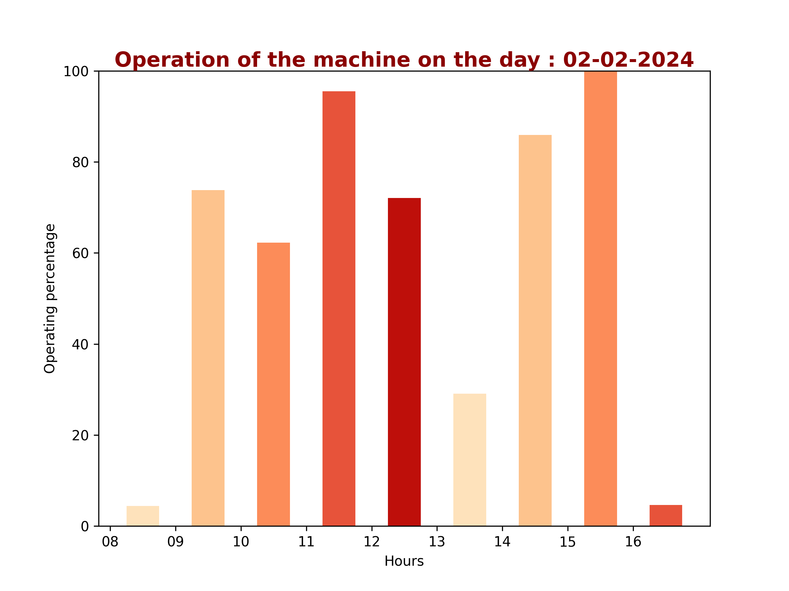
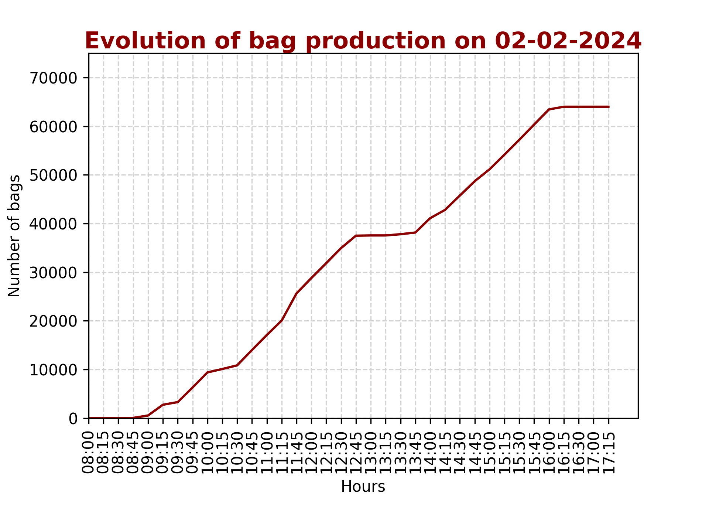

Utilisation de Python Matplotlib pour créer des visualisation à partir de données machine.
================================================================

Dans le cadre d'un projet européen auquel a répondu la société Talk Me, la société Agilack a été sollicitée pour mettre en place un monitoring machine. Des capteurs ont été installés sur une machine de production de sacs afin de récupérer les logs machines dansle but à terme d'optimiser la production.
La première demande du client était de connaitre d'une part les taux de fonctionnement journalier et d'autre part de visualiser la courbe de production journalière de sacs. 
C'est l'objectif de ce projet qui produit les graphiques demandés dont vous avez un exempe ci-dessous.
La difficulté de traitement est venu de l'irrégularité des logs qui pouvaient avoir lieu à quelques microsecondes d'intervalle ou à plusieurs minutes.

<table>
<tr>
<td></td>
<td></td>
</tr>
<tr>
<td>Fig1: Représentation graphique des taux de fonctionnement </td>
<td>Fig2: Représentation graphique de la courbe de production journalière </td>
</tr>
</table>

